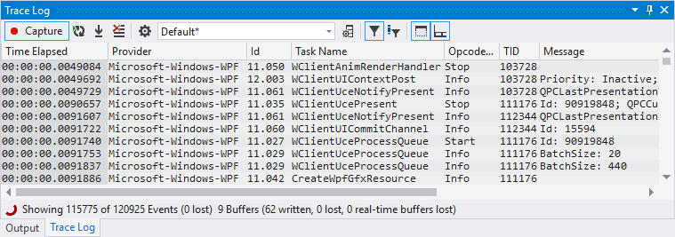

# EventTraceKit

## Overview

Provides tools to ease development using [Event Tracing for Windows (ETW)](https://docs.microsoft.com/en-us/windows/desktop/ETW/event-tracing-portal).

Includes the following:

- `Event Trace Kit`: A Visual Studio extension to consume real-time ETW traces.
   It provides a highly customizable and filterable trace log tool window.
   Trace sessions can be automatically started whenever a project is started from
   Visual Studio (even without debugging) offering a compelling alternative to the
   default output window and APIs such as OutputDebugString.

   

   Download this extension from the [VS Marketplace](https://marketplace.visualstudio.com/items?itemName=nrieck.EventTraceKit).

- `EventManifestFramework`: .NET library to parse ETW instrumentation manifests (*.man files)
- `EventManifestCompiler`: Used to compile ETW instrumentation manifests.
   Generates ETW binary templates and message tables to be embedded in provider
   executables as well es C++ logging code. Functions as a modern alternative
   to [Message Compiler (mc.exe)](https://docs.microsoft.com/en-us/windows/desktop/WES/message-compiler--mc-exe-).
- `EventManifestCompiler.Build.Tasks`: Nuget package that integrates the manifest
   compiler into C++ MSBuild projects.

## Building

Requires

- Visual Studio 2017 with C# / C++ (v141) and VS extension development workloads
- Windows SDK 10.0.16299.0
- [Boost](https://www.boost.org/)
- [Google Test](https://github.com/google/googletest)

To build the Visual Studio extension, run `msbuild etk.build.proj -t:Pack` in the
root directory. For the manifest compiler and MSBuild tasks run
`msbuild emc.build.proj -t:Pack`. See the `dist` directory for build artifacts.

## License

Code licensed under the [MIT License](LICENSE.txt).
